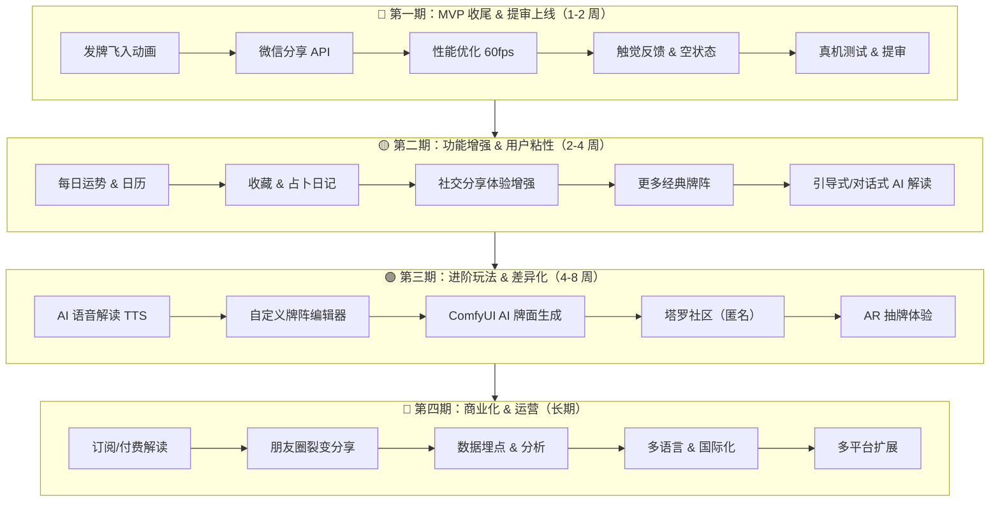
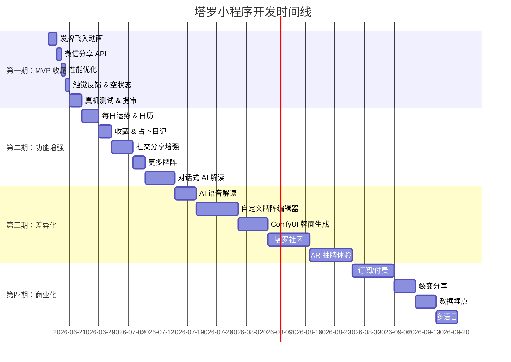

# 塔罗牌占卜小程序 - 后继开发规划书

> 创建日期：2026-06-15
> 基于 PLAN.md 中 Stage 5 未完成项 + 功能增强规划
> 当前项目完成度：~65%

---

## 一、项目当前状态

| 阶段 | 完成度 | 说明 |
|------|--------|------|
| 阶段 1：基础架构 + 静态页面 | ~100% | ✅ 5 页面骨架 + 深色主题 + 路由 |
| 阶段 2：核心数据 + 牌库 | ~100% | ✅ 78 张牌数据 + 分类筛选 + 详情 |
| 阶段 3：抽牌核心逻辑 | ~75% | ⬜ 发牌飞入动画待开发 |
| 阶段 4：历史记录 + 分享海报 | ~85% | ⬜ 微信分享 API 待集成（海报已完成后端方案） |
| 阶段 5：打磨 + 提审 | 0% | ⬜ 尚未开始 |
| **总计** | **~65%** | |

---

## 二、总体路线图



---

## 三、第一期：MVP 收尾 & 提审上线（1-2 周）

> **目标**：完成 PLAN.md 中 Stage 5 的所有待办项，将产品推进到可提审状态。

### 3.1 发牌飞入动画（PLAN 3.4）

**当前问题**：抽牌页动画全屏后直接跳转到结果页，缺少牌从牌堆"飞"到目标位置的过渡动画。

**技术方案**：
- 在 `/pages/draw/draw.vue` 中实现牌从顶部/中心以抛物线轨迹飞到目标卡槽位置的 CSS 动画
- 使用 `@keyframes` 实现抛物线轨迹（CSS `translate` + `transform-origin`），配合 `cubic-bezier` 缓动曲线
- 动画时序：逐张延迟 200ms 依次飞出

**实现要点**：
```css
@keyframes fly-to-slot {
  0%   { transform: translate(0, 0) scale(0.8); opacity: 0.5; }
  50%  { transform: translate(var(--dx), var(--mid-y)) scale(1.05); opacity: 1; }
  100% { transform: translate(var(--dx), var(--dy)) scale(1); opacity: 1; }
}
.card-fly { animation: fly-to-slot 0.6s cubic-bezier(0.25, 0.46, 0.45, 0.94) forwards; }
```

**预估工时**：1-2 天

---

### 3.2 微信分享 API 集成（PLAN 4.5）

**当前问题**：结果页缺少分享功能，用户无法将占卜结果分享给好友。

**技术方案**：
- 在结果页接入 `wx.showShareMenu` / `wx.onShareAppMessage`
- 分享卡片内容：牌阵类型 + 关键牌名 + 一句解读摘要
- 分享图片使用后端海报服务生成的海报缩略图

**实现要点**：
```typescript
// 在 result.vue 中
onMounted(() => {
  wx.showShareMenu({ withShareTicket: true })
})

wx.onShareAppMessage(() => ({
  title: `🔮 ${spreadName} - ${summary}`,
  path: `/pages/index/index`,
  imageUrl: posterThumbUrl,
}))
```

**预估工时**：0.5-1 天

---

### 3.3 性能优化（PLAN 5.1）

**当前问题**：翻牌动画可能出现卡顿，牌面图片加载有延迟。

**技术方案**：
- **GPU 加速**：为 `.flip-container` 添加 `will-change: transform` 启用 GPU 合成层
- **图片预加载**：在抽牌阶段预先加载牌面图片，减少翻牌时白屏
- **分包优化**：检查小程序包体积，确保单包 ≤ 2MB
- **动画帧率监控**：确保翻牌动画 ≥ 60fps

**预估工时**：1 天

---

### 3.4 触觉反馈 & 空状态处理（PLAN 5.3-5.5）

**触觉反馈**：
- 抽牌按钮点击：`wx.vibrateShort({ type: 'medium' })`
- 翻牌成功：`wx.vibrateShort({ type: 'light' })`
- 牌阵选择切换：`wx.vibrateShort({ type: 'light' })`

**空状态处理**：
- 历史记录无数据时：展示引导文案 + 开始占卜按钮
- 牌库搜索无结果时：展示空状态插画 + 提示
- 网络异常时（AI 解读）：展示本地降级解读 + 重试按钮

**错误边界**：
- 动画中断时的回退逻辑
- 数据异常时的兜底展示
- 海报生成失败时的降级方案

**预估工时**：1 天

---

### 3.5 真机测试 & 小程序提审（PLAN 5.6-5.7）

**真机测试清单**：

| 测试项 | 说明 |
|--------|------|
| 首屏加载速度 | < 2s |
| 抽牌全流程 | 牌阵选择 → 洗牌 → 翻牌 → 解读 |
| 海报生成 | 后端服务可用性 + 图片清晰度 |
| 历史记录 | 增删查 + 50 条上限 |
| 牌库浏览 | 分类筛选 + 搜索 + 详情 |
| 分享功能 | 分享卡片正确性 |
| 兼容性 | iOS 14+ / Android 8+ |
| 深色模式 | UI 一致性 |

**提审准备**：
- 小程序类目选择（建议：生活服务 > 星座/运势）
- 隐私协议（用户问题数据仅本地存储，不上传）
- 小程序描述 + 截图准备（5 张功能截图）
- 代码包优化（分包加载、图片压缩）

**预估工时**：2-3 天

---

## 四、第二期：功能增强 & 用户粘性（2-4 周）

> **目标**：丰富产品功能，提升用户留存率和活跃度。

### 4.1 每日运势 & 日历视图

**需求背景**：REQUIREMENTS.md 中已规划"今日运势"功能，作为每日打开小程序的"钩子"。

**功能设计**：
- **首页日运卡**：每日自动抽一张牌，展示简短指引（关键词 + 一句话运势）
- **运势日历页**：日历视图，用户可回看历史每天的运势记录
- **运势通知**（可选）：利用小程序订阅消息，每日推送运势提醒

**数据存储**：
```typescript
interface DailyFortune {
  date: string           // YYYY-MM-DD
  cardId: number         // 当日牌 ID
  orientation: 'upright' | 'reversed'
  summary: string        // 简短运势摘要
}
```

**新增页面**：`/pages/fortune/fortune.vue`

**预估工时**：3-4 天

---

### 4.2 收藏 & 占卜日记

**功能设计**：
- 用户可对特定占卜记录标记「收藏/星标」
- 支持对记录添加个人笔记/感悟
- 收藏列表独立展示（在历史页增加 Tab 切换）

**数据模型扩展**：
```typescript
interface ReadingRecord {
  // ... 现有字段
  isFavorite: boolean      // 是否收藏
  note: string             // 用户笔记
}
```

**UI 交互**：
- 结果页增加「收藏」按钮（星标图标）
- 记录详情页增加「添加笔记」入口
- 笔记编辑器（富文本/纯文本）

**预估工时**：2-3 天

---

### 4.3 社交分享体验增强

**功能设计**：
- 海报模板选择：提供 3-5 套不同风格的模板（古典、现代、梦幻等）
- 匿名提问箱：用户可匿名提交问题，由其他用户抽牌解答
- 分享统计：查看自己的占卜被多少人查看/点赞

**技术要点**：
- 海报模板切换通过后端 `template` 参数控制不同 HTML 模板
- 匿名提问箱需要新增后端 API（可选，初期可降级为纯前端模拟）

**预估工时**：3-5 天

---

### 4.4 更多经典牌阵

**当前状态**：仅支持 3 种牌阵（单张、三张、凯尔特十字）。

**新增牌阵**：

| 牌阵名称 | 牌数 | 适用场景 |
|----------|------|----------|
| 关系牌阵 | 7 张 | 双方态度、关系现状、未来走向 |
| 星芒牌阵 | 6 张 | 凯尔特十字的变体，更聚焦核心问题 |
| 是否牌阵 | 5 张 | 针对二选一问题的快速占卜 |
| 四季牌阵 | 4 张 | 春夏秋冬四季度运势 |
| 黄道十二宫 | 12 张 | 全面的人生运势分析 |

**实现方式**：在 `src/data/spreads.ts` 中扩展 `spreads` 字典，新增牌阵配置。

```typescript
// 新增牌阵示例
{
  id: 'relationship',
  name: '关系牌阵',
  cards: 7,
  positions: [
    { name: '你的态度', x: 10, y: 30 },
    { name: '对方态度', x: 90, y: 30 },
    { name: '关系现状', x: 50, y: 10 },
    { name: '你的期望', x: 30, y: 60 },
    { name: '对方期望', x: 70, y: 60 },
    { name: '阻碍因素', x: 50, y: 50 },
    { name: '未来发展', x: 50, y: 80 },
  ],
  description: '深入分析两人关系的各个维度',
}
```

**预估工时**：2-3 天

---

### 4.5 引导式/对话式 AI 解读

**当前问题**：AI 解读是一次性展示全部结果，缺乏互动感。

**功能设计**：
- AI 先展示综合概述（一段话总结整体牌阵含义）
- 用户可追问某张牌（如"战车牌具体是什么意思？"）
- 多轮对话式解读，更像真人塔罗师交互

**技术架构**：

```
前端 (对话 UI)
  ↓ POST /api/reading/chat
tarot-reading-api (Cloudflare Worker)
  ↓ 携带上下文（牌阵 + 历史对话）
AI API（OpenAI / Claude）
  ↓ 流式返回
前端 (SSE 实时展示)
```

**UI 设计**：
- 结果页新增"深度解读"按钮，进入对话模式
- 对话界面：聊天气泡 + 打字机效果（SSE 流式渲染）
- 预设追问选项（"这张牌在爱情方面代表什么？"、"牌阵整体是吉是凶？"）

**预估工时**：5-7 天

---

## 五、第三期：进阶玩法 & 差异化（4-8 周）

> **目标**：打造独特的产品竞争力，与市场上其他塔罗 App 形成差异化。

### 5.1 AI 语音解读（TTS）

**功能设计**：
- 将 AI 解读文本通过 TTS 转成语音播放
- 支持多种音色（温柔女声、沉稳男声、神秘音效）
- 背景音乐可选（舒缓冥想音乐）

**技术方案**：
- 后端新增 `/api/reading/tts` 端点
- 使用 Cloudflare AI 的 TTS 模型或接入第三方 TTS API
- 前端用 `wx.createInnerAudioContext` 播放

**预估工时**：3-5 天

---

### 5.2 自定义牌阵编辑器

**功能设计**：
- 用户自由定义牌阵：位置数量、名称、排列方式
- 拖拽式布局编辑器
- 支持分享自定义牌阵给好友
- 热门牌阵广场（用户创建的热门牌阵）

**技术要点**：
- 使用 `movable-view` 组件实现拖拽布局
- 牌阵配置 JSON 序列化存储
- 社区牌阵分享链接

**预估工时**：7-10 天

---

### 5.3 ComfyUI AI 牌面生成

**背景**：`/workspace/ComfyUI/` 目录下已有 ComfyUI 环境，可以联动使用。

**功能设计**：
- 用户用自然语言描述想要一张什么风格的牌
  - 如"赛博朋克风格的愚者"、"水墨画风的女祭司"
- 调用 ComfyUI 的 Stable Diffusion 工作流生成 AI 塔罗牌面图
- 用户可收藏自己生成的牌，形成"个性化牌库"

**技术架构**：
```
小程序前端
  ↓ POST /api/comfyui/generate { prompt, cardType, style }
tarot-reading-api (Worker)
  ↓ 转发请求
ComfyUI 服务
  ↓ Stable Diffusion 生成
返回图片 URL → 前端展示
```

**预估工时**：5-7 天

---

### 5.4 塔罗社区（匿名投稿）

**功能设计**：
- 匿名投稿：用户可匿名分享占卜经历和感悟
- 社区广场：按时间/热度排序的投稿流
- 互动功能：点赞、评论（可选）
- 每日话题："今天你抽到了什么牌？"

**技术要点**：
- 需要新增后端 API + 数据库
- 内容审核机制（敏感词过滤）
- 匿名身份生成（随机昵称 + 头像）

**预估工时**：7-10 天

---

### 5.5 AR 抽牌体验

**功能设计**：
- 微信小程序已支持 AR（`wx.visionKit` / `wx.createVKSession`）
- 用摄像头识别手势（如"切牌"动作）触发抽牌
- 在真实桌面用 AR 渲染 3D 牌面

**技术方案**：
- 使用微信 VKSession 进行平面检测
- 在检测到的平面上放置 3D 牌阵
- 手势识别触发翻牌

**风险提示**：
- 微信 AR 能力支持度有限，部分低端机型不支持
- 建议作为实验性功能，不影响核心流程

**预估工时**：5-10 天

---

## 六、第四期：商业化 & 运营（长期）

> **目标**：实现商业闭环，持续运营增长。

### 6.1 订阅/付费模式

| 层级 | 价格 | 权益 |
|------|------|------|
| 免费版 | ¥0 | 每日 3 次占卜，基础牌阵（3 种），普通解读 |
| 进阶版 | ¥9.9/月 | 无限占卜，全部牌阵，AI 深度解读 |
| 专业版 | ¥19.9/月 | 进阶版全部 + 语音解读 + 自定义牌面生成 + 对话式解读 |

**技术要点**：
- 微信支付接入
- 订阅状态管理（Pinia + 本地存储）
- 使用次数计数器（每日重置）

---

### 6.2 朋友圈裂变分享

- 生成精美的 9 宫格海报，引导用户分享朋友圈
- "邀请好友帮你选牌"的互动玩法
- 分享解锁更多牌阵的激励机制

---

### 6.3 数据埋点 & 运营后台

- 热门问题趋势分析
- 高频牌统计（"今天抽到死神牌的人最多"）
- 用户画像分析
- 简单运营后台（数据看板 + 内容管理）

---

### 6.4 多语言 & 国际化

- 目前牌面数据仅有中文，需补充英文/日文
- `TarotCard` 类型已有 `nameEn` 字段，需补充完整英文解读
- 利用 `wx.getSystemInfoSync().language` 自动切换

---

### 6.5 多平台扩展

- 抖音小程序
- 支付宝小程序
- H5 独立站（PWA）

---

## 七、技术债务清理

在推进新功能的同时，以下技术债务建议优先处理：

| 项目 | 说明 | 优先级 |
|------|------|--------|
| pnpm 配置 | `.npmrc` shamefully-hoist=true | 低 |
| TypeScript 严格模式 | 修复 any 类型 | 中 |
| 组件单元测试 | Vitest 基础测试覆盖 | 中 |
| CI/CD 流水线 | GitHub Actions 自动构建 | 低 |
| 代码规范 | ESLint + Prettier 统一风格 | 中 |
| 性能监控 | 首屏加载时间、API 响应时间 | 低 |

---

## 八、里程碑时间线



---

## 九、相关文档索引

| 文档 | 路径 | 说明 |
|------|------|------|
| 需求文档 | `docs/REQUIREMENTS.md` | 产品功能需求定义 |
| 执行规划 | `docs/PLAN.md` | 原始 5 阶段开发计划 |
| 后端海报方案 | `docs/POSTER_BACKEND_PLAN.md` | 海报微服务技术方案（已实施） |
| 海报拆分方案 | `docs/POSTER_SPLIT_PLAN.md` | SharePoster 组件解耦方案（待开发） |
| 本规划书 | `docs/ROADMAP.md` | 后继开发规划 |

---

> **最后更新**：2026-06-15
> **下次评审**：第一期完成后
